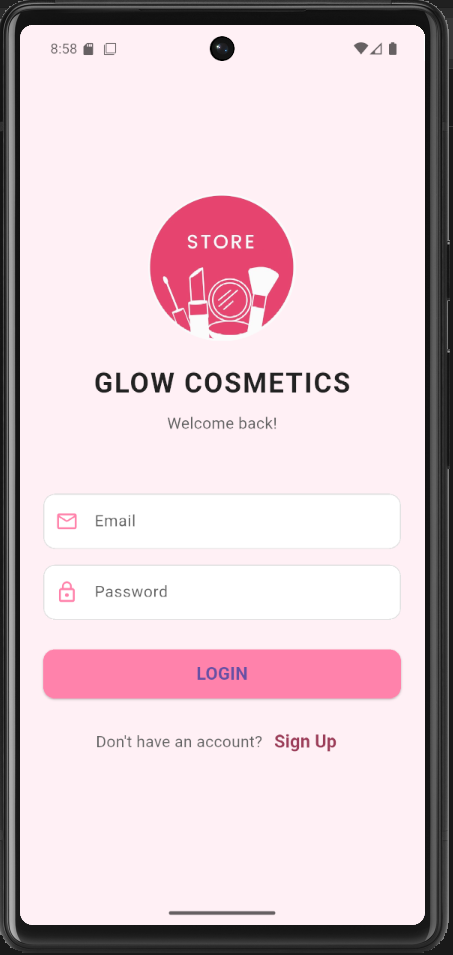
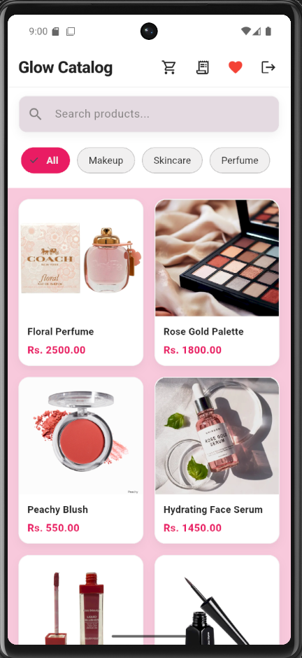
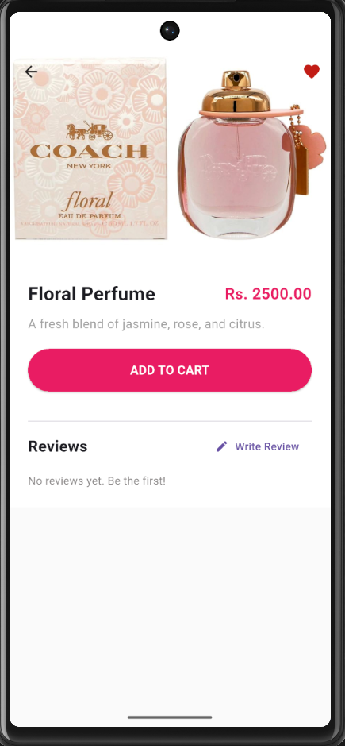
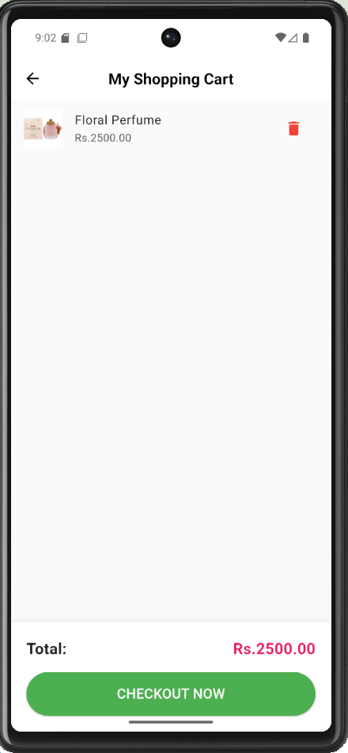

# 💄 Glow Cosmetics Mobile App

A modern, full-featured e-commerce mobile application built with **Flutter** and **Firebase**. Users can browse cosmetics, manage a wishlist, add items to a cart, and place orders.

<p align="center">
 
</p>

## ✨ Features

* **Authentication**: Secure Login and Registration using Firebase Auth.
* **Product Catalog**: Browse products by categories (Makeup, Skincare, Perfume).
* **Smart Search**: Real-time search functionality to find products instantly.
* **Product Reviews**: Users can rate products and leave detailed feedback.
* **Wishlist**: Save favorite items for later.
* **Shopping Cart**: Add items and view total price calculations.
* **Order Management**: Place orders and view order history with status tracking.
* **Safety Checks**: Admin tools include duplicate data prevention for the database.

## 📱 Tech Stack

* **Frontend**: Flutter (Dart)
* **Backend**: Firebase (Firestore Database, Authentication)
* **State Management**: `setState` & Streams
* **Architecture**: MVC (Model-View-Controller) pattern

## 📸 Screenshots

| Login Screen | Home Screen | Product Details | Cart & Orders |
|:---:|:---:|:---:|:---:|
|  |  |  |  |


## 🚀 Getting Started

### Prerequisites
* [Flutter SDK](https://flutter.dev/docs/get-started/install) installed.
* VS Code or Android Studio.
* An Android Emulator or Physical Device.

### Installation

1.  **Clone the repository**
    ```bash
    git clone [[https://github.com/pavani-edirisinghe/Cosmetics-MobileApp.git]]
    cd Cosmetics-MobileApp
    ```

2.  **Install Dependencies**
    ```bash
    flutter pub get
    ```

3.  **Firebase Setup**
    * This project uses Firebase. You must add your own `google-services.json` file to:
    * `android/app/google-services.json`

4.  **Run the App**
    ```bash
    flutter run
    ```

## 📂 Project Structure

```text
📦 Cosmetics_app
 ┣ 📂 .vs
 ┣ 📂 lib
 ┃ ┣ 📂 models        # Data models (Product, Order, User, Review)
 ┃ ┣ 📂 providers     # State management (e.g., CartProvider)
 ┃ ┣ 📂 screens       # UI Screens (Home, Auth, Cart, Wishlist)
 ┃ ┣ 📂 services      # Firebase logic (AuthService, DatabaseService)
 ┃ ┗ 📄 main.dart
 ┗ 📄 README.md
```

## 🛡️ Database Safety
The app includes a safety mechanism in `DatabaseService.dart` to prevent duplicate product uploads. The `addDummyData()` function automatically checks if the database is populated before running.

---
Made with by [Pavani Edirisinghe & Piyumi Sandunika]

